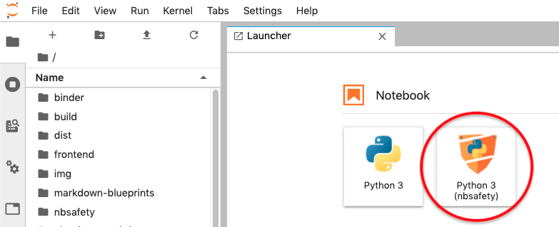

nbsafety
========

<a href="https://github.com/runtime-jupyter-safety/nbsafety/actions"></a>
<a href="https://opensource.org/licenses/BSD-3-Clause"></a>
<a href="https://pypi.org/project/nbsafety/"></a>


Install
-------
To install, grab the package and install the Jupyter KernelSpec as follows:
```
pip install nbsafety
```

Running
-------

Because `nbsafety` is implemented as a custom Jupyter kernel, it works for
both Jupyter notebooks and JupyterLab.
To run an `nbsafety` kernel, select "Python 3 (nbsafety)" from the list
of notebook types in Jupyter's "New" dropdown dialogue:


For JupyterLab, similarly select "Python 3 (nbsafety)" from the list
of available kernels in the Launcher tab:



Uninstall
---------
In addition to `pip uninstall nbsafety`, it is also necessary
to deregister the kernel from Jupyter for a full uninstall:
```
jupyter kernelspec uninstall nbsafety
```

License
-------
Code in this project licensed under the [BSD-3-Clause License](https://opensource.org/licenses/BSD-3-Clause).
