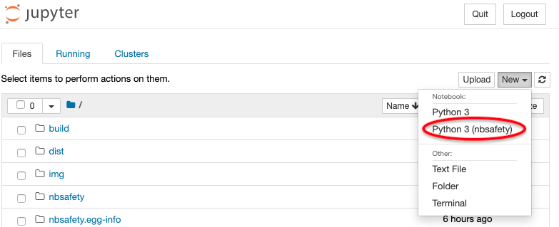

nbsafety
========

[](https://github.com/runtime-jupyter-safety/nbsafety/actions)
[](https://opensource.org/licenses/BSD-3-Clause)


Install
-------
To install, grab the package and install the Jupyter KernelSpec as follows:
```
pip install nbsafety
```

Running
-------

To run an `nbsafety` kernel, select "Python 3 (nbsafety)" from the list
of notebook types in Jupyter's "New" dropdown dialogue:



Future
------

Currently `nbsafety` is supported for Jupyter notebooks (not JupyterLab).
JupyterLab support is targeted for a future release.

Uninstall
---------
```
jupyter kernelspec uninstall python3-nbsafety
```

License
-------
Code in this project licensed under the [BSD-3-Clause License](https://opensource.org/licenses/BSD-3-Clause).
